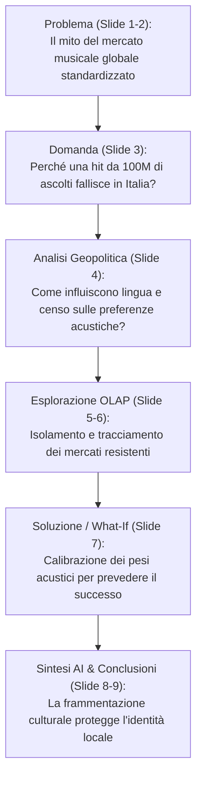

# La Storia del Pitch: Standardizzazione Globale vs Resistenza Culturale
> **Guida Narrativa e Discorso (Speech) per la Presentazione del Progetto Spotify-DWH**

Questo documento contiene la **storia completa** slide per slide per la presentazione orale. La narrazione segue la struttura accademica richiesta: **Domanda (Problema) → Metodologia/Soluzione → Risoluzione empirica con i dati**.

---

## Struttura della Narrazione (Storytelling)

---

## Slide 1: Il Titolo & La Domanda di Ricerca
* **Titolo in Slide:** *Classifiche Globali vs Gusti Locali: Il Gusto Musicale è Standardizzato?*
* **Sottotitolo:** *Un'analisi dimensionale e ROLAP di 2.1 milioni di chart entries in 72 paesi per quantificare la divergenza culturale locale rispetto alla popolarità globale.*
* **Cosa dire al Professore (Speech):**
  > "Buon giorno professore. Il punto di partenza del nostro progetto non è una semplice esercitazione tecnica, ma una domanda di ricerca di geopolitica culturale: **la globalizzazione dello streaming ha davvero uniformato i gusti musicali nel mondo, o sopravvivono delle resistenze locali invalicabili?** 
  > Per rispondere a questa domanda, abbiamo costruito un Data Warehouse integrando oltre 2.1 milioni di ingressi in classifica su Spotify in 72 nazioni con gli indicatori socio-economici della Banca Mondiale, analizzando come le caratteristiche acustiche dei brani interagiscono con la cultura locale."

---

## Slide 2: Il Paradosso di Partenza (Hook)
* **Titolo in Slide:** *Il Paradosso di Popolarità (Hook)*
* **Cosa dire al Professore (Speech):**
  > "Perché questo è un problema reale? Per l'industria discografica e per i distributori, vendere musica oggi sembra facile: si crea una hit globale e si distribuisce ovunque. Tuttavia, i dati evidenziano un paradosso sistematico: **brani con un punteggio di popolarità globale superiore a 90/100 spesso non riescono nemmeno ad entrare nella Top 10 di molti paesi**. 
  > Generi come l'Afrobeats in Nigeria, la musica latina in Sud America o il K-Pop in Corea creano veri e propri ecosistemi chiusi. Questo ci mostra che la 'popolarità globale' è una metrica astratta che maschera profonde barriere culturali."

---

## Slide 3: L'Anomalia nei Dati (Il Caso Italia)
* **Titolo in Slide:** *La Resistenza Culturale del Mercato Locale (Caso Italia vs Global)*
* **Grafico visualizzato:** BarChart di confronto tra le medie acustiche italiane e globali.
* **Cosa dire al Professore (Speech):**
  > "Osserviamo l'anomalia empirica analizzando il nostro mercato, l'Italia, confrontato con la media globale. 
  > Il grafico evidenzia due divergenze macroscopiche: 
  > 1. La **Valence (l'indice di felicità acustica)** in Italia è significativamente più bassa rispetto alla media globale. Prediligiamo sonorità più scure, malinconiche e introspettive.
  > 2. Il tasso di **Explicit Content (testi espliciti)** in Italia è quasi tre volte superiore a quello globale (+200%). 
  > Questo è guidato dal fenomeno della Trap e dell'Hip-Hop locale in lingua italiana. Questa firma acustica unica funge da scudo culturale: una hit pop solare e pulita americana fatica a penetrare la Top 10 italiana perché è l'opposto acustico di ciò che consumiamo."

---

## Slide 4: La Barriera Geopolitica (Censo e Lingua)
* **Titolo in Slide:** *La Barriera Geopolitica: Censo e Lingua*
* **Grafico visualizzato:** BarChart raggruppato per Continente, Lingua e Fascia di Reddito (dati Banca Mondiale).
* **Cosa dire al Professore (Speech):**
  > "Estendendo l'analisi a livello globale, scopriamo che la divergenza non è casuale, ma è strutturata su fattori geopolitici e macroeconomici. 
  > Raggruppando i dati tramite le dimensioni che abbiamo integrato nel nostro DWH, emerge ad esempio che i paesi a lingua romanza (Spagnolo, Portoghese) mostrano indici di Valence ed Energy molto più elevati (musica allegra e ballabile), mentre i paesi ad alto reddito (High Income) consumano musica con indici di Valence più bassi e maggiore complessità acustica. 
  > La lingua e il censo non sono solo dati statistici, ma definiscono i confini della sensibilità musicale di un popolo."

---

## Slide 5: OLAP Live: Slice & Dice (Isolare i Mercati Resistenti)
* **Titolo in Slide:** *OLAP Live: Isolare la Resistenza Culturale (Slice & Dice)*
* **Interazione:** Pannello interattivo per filtrare nazione, genere e anno.
* **Cosa dire al Professore (Speech):**
  > "Per esplorare queste relazioni, la nostra architettura consente di effettuare operazioni OLAP in tempo reale direttamente nel browser tramite DuckDB-Wasm. 
  > Con l'operazione di **Slice**, possiamo isolare un singolo paese per analizzarne la traiettoria temporale. Con il **Dice**, andiamo a ritagliare un sotto-cubo multidimensionale (ad esempio: solo il genere 'Trap', in 'Italia', nel '2024') per calcolare la forza in classifica delle canzoni resistenti rispetto a quelle importate. Questo dimostra la flessibilità dello schema a stella che supporta il querying multidimensionale veloce."

---

## Slide 6: OLAP Live: Drill-Down & Roll-Up (Navigazione Gerarchica)
* **Titolo in Slide:** *OLAP Live: Traiettoria delle Hit Locali (Drill-Down, Roll-Up & Pivot)*
* **Interazione:** Selezione dell'operazione di aggregazione spaziale o temporale.
* **Cosa dire al Professore (Speech):**
  > "Qui dimostriamo la navigazione lungo le gerarchie dimensionali del DWH. 
  > Con il **Drill-Down** scendiamo dal livello temporale dell'anno a quello del dettaglio settimanale per osservare la stagionalità delle hit (ad esempio, l'esplosione dei tormentoni estivi). 
  > Con il **Roll-Up** saliamo di scala geografica, passando dalle singole classifiche nazionali alla classifica 'Global' (GL) per verificare se una canzone nata locale è riuscita a rompere la barriera culturale e a scalare il mercato mondiale, o se è rimasta un fenomeno puramente domestico."

---

## Slide 7: La Soluzione: Il Simulatore What-If
* **Titolo in Slide:** *Il Simulatore What-If: Calibrare la Resistenza Culturale*
* **Interazione:** Sliders interattivi per regolare i pesi di Valence, Energy, Danceability e Popolarità Globale.
* **Cosa dire al Professore (Speech):**
  > "La risoluzione operativa al nostro problema è rappresentata da questa simulazione What-If. 
  > Abbiamo implementato un motore di simulazione dinamico che consente a un utente (ad esempio una casa discografica) di selezionare un paese e calibrare i pesi di allineamento acustico di un brano rispetto alle medie storiche del paese. 
  > Regolando gli slider (allineamento con la Valence locale, l'Energy locale e il peso della Popolarità Globale), DuckDB ricalcola istantaneamente sul client la classifica simulata. 
  > Questo strumento dimostra empiricamente che per vincere in un mercato locale non basta investire in marketing globale: bisogna adattare le caratteristiche acustiche del brano all'identità culturale di quel mercato."

---

## Slide 8: AI Interpretation: L'Etnomusicologo Virtuale
* **Titolo in Slide:** *Interpretazione con AI: L'Etnomusicologo Virtuale*
* **Interazione:** Generazione narrativa con LLM.
* **Cosa dire al Professore (Speech):**
  > "Per arricchire l'output analitico del Data Warehouse, abbiamo integrato un agente di intelligenza artificiale locale (Gemma) che funge da etnomusicologo virtuale. 
  > L'AI prende i risultati grezzi delle query multidimensionali appena eseguite su DuckDB e genera un report qualitativo, spiegando le motivazioni culturali, storiche e linguistiche dietro ai dati quantitativi. Per garantire performance ed economicità di calcolo, abbiamo implementato un sistema di caching locale basato su hash MD5 dei parametri della query."

---

## Slide 9: Conclusioni: L'Inesistenza della Formula Unica
* **Titolo in Slide:** *Conclusioni: La Diversità Preservata*
* **Punti chiave in slide:** Omologazione Respinta, Valore del Locale, Efficacia del DWH.
* **Cosa dire al Professore (Speech):**
  > "In conclusione, il nostro studio dimostra due punti fondamentali:
  > 1. A livello socio-culturale, **l'algoritmo di raccomandazione globale non ha annullato le specificità locali**. La resistenza culturale ed etnica è viva e vegeta nelle classifiche nazionali.
  > 2. A livello tecnologico, **il Data Warehouse multidimensionale si dimostra uno strumento essenziale**: permette di superare la piattezza dei dati transazionali grezzi e di estrarre valore strategico, trasformando milioni di righe di log in decisioni mirate per il mercato musicale internazionale.
  > Grazie per l'attenzione. Sono pronto per le vostre domande."
